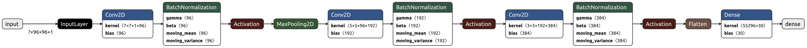
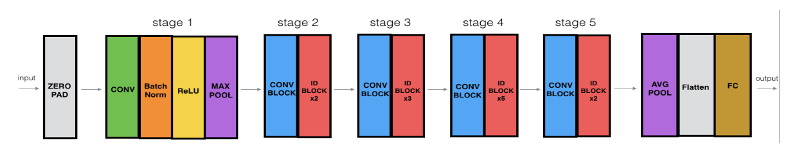
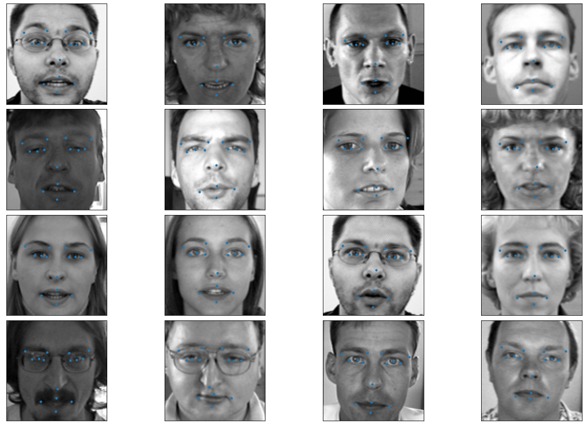

# Face Landmark Detection
The goal of this project is to find keypoints (landmarks) on images of faces.

## Dataset
- [The dataset](https://www.kaggle.com/c/facial-keypoints-detection/data) contains 7049 training images and 1783 test image.
- Image size is 96x96.
- Number of keypoints is 15, since each keypoint has an x and y coordinate, the model has to produce 30 output numbers.

## Approach
Two models have been trained, a simple baseline CNN model and a full ResNet-50 model.

### Baseline CNN
It is a straightforward convolutional model with the following architecture:

### ResNet-50
A standard ResNet with the following structure:

## Result

