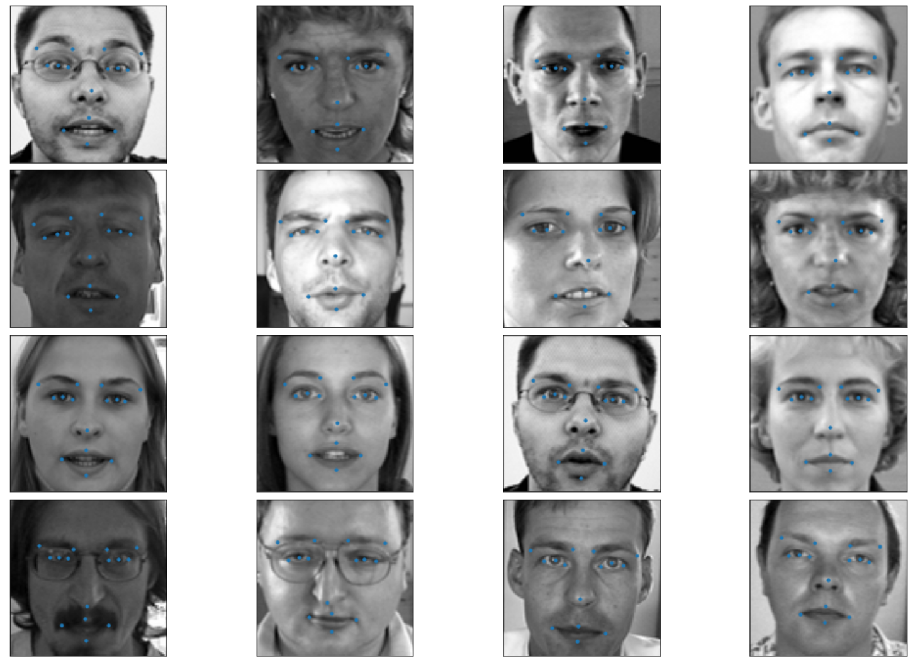

# Face Landmark Detection
The goal of this project is to find keypoints (landmarks) on images of faces.

## Dataset
- [The dataset](https://www.kaggle.com/c/facial-keypoints-detection/data) contains 7049 training images and 1783 test image.
- Image size is 96x96.
- Number of keypoints is 15, since each keypoint has an x and y coordinate, the model has to produce 30 output numbers.

## Approach
Two models have been trained, a simple baseline CNN model and a full ResNet-50 model.

### Baseline CNN
It is a straightforward convolutional model with the following architecture:


### ResNet-50
A standard ResNet with the following structure:


## Result
Training after 2000 epochs with a GTX 1080:
- Baseline:
    - epoch time: ~1s
    - loss: 0.1125 
    - mae: 0.1598 
    - val_loss: 2.6752 
    - val_mae: 0.8954
- ResNet-50:
    - epoch time: ~10s
    - loss: 0.0955 import praw
    - mae: 0.1079 
    - val_loss: 2.7508 
    - val_mae: 0.7765




# Real-time landmark dectection using mediapipe library
Run ```python rt_face.py```using the webcam to detect face landmarks in real-time!
